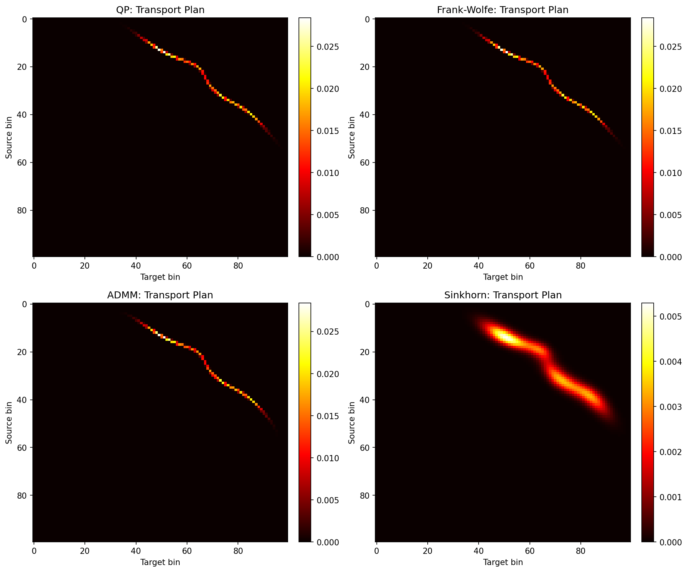
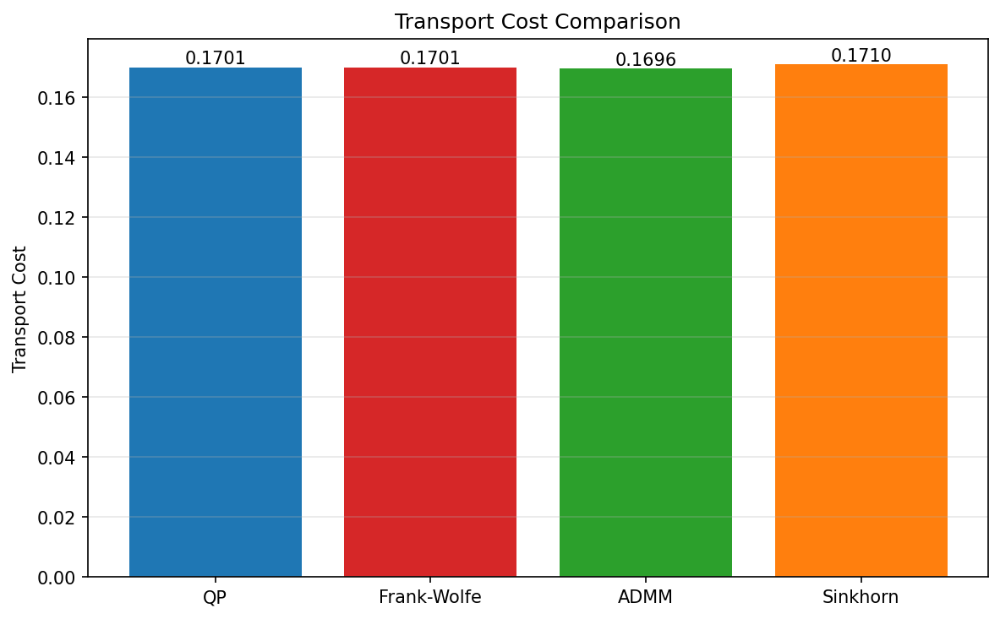
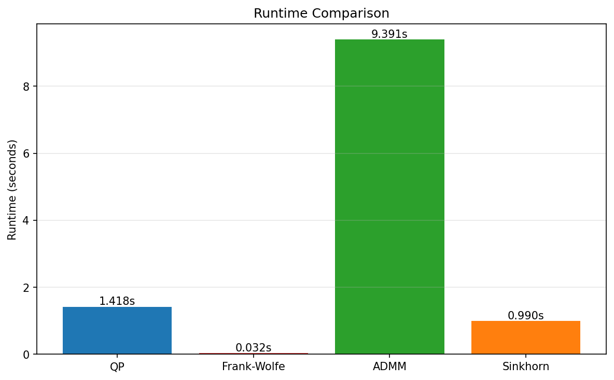

# Optimal Transport Methods Comparison

🚀 A comprehensive comparison of four classical **Optimal Transport (OT)** algorithms implemented in Python.

[](https://www.python.org/downloads/)
[](https://opensource.org/licenses/MIT)

## 📋 Overview

This repository implements and compares four fundamental algorithms for solving the optimal transport problem on 1D distributions:

1. **Quadratic Programming (QP)** - CVXPY-based convex optimization with L2 regularization
2. **Frank-Wolfe Algorithm** - First-order iterative method for unregularized OT
3. **ADMM** (Alternating Direction Method of Multipliers) - Splitting method for unregularized OT
4. **Sinkhorn Algorithm** - Fast entropy-regularized OT solver

All methods are tested on the same Gaussian mixture distributions with identical experimental settings for fair comparison.

## 🎯 Key Features

- ✅ Clean, modular implementation of all four methods
- ✅ Comprehensive convergence tracking and diagnostics
- ✅ Automatic generation of comparison plots
- ✅ Detailed performance metrics (transport cost, entropy, runtime, iterations)
- ✅ Publication-ready visualization

## 📊 Quick Results

| Method | Transport Cost | Runtime (s) | Iterations | Convergence |
|--------|---------------|-------------|------------|-------------|
| **QP** | 0.170085 | 1.42 | N/A | Direct solve |
| **Frank-Wolfe** | 0.170066 | 0.032 ⚡ | 12 | Fast |
| **ADMM** | 0.169593 ✅ | 9.39 | 5000 | Slow |
| **Sinkhorn** | 0.170999 | 0.99 | 837 | Smooth |

**Key Insights**:
- 🏆 **Best Cost**: ADMM (but slowest)
- ⚡ **Fastest**: Frank-Wolfe (300x faster than ADMM)
- 🎯 **Most Practical**: Sinkhorn (good balance of speed and accuracy)

## 🛠️ Installation

### Prerequisites

```bash
pip install numpy matplotlib cvxpy scipy
```

### Required Packages

- `numpy >= 1.20.0`
- `matplotlib >= 3.3.0`
- `cvxpy >= 1.1.0`
- `scipy >= 1.6.0`

## 🚀 Usage

### Run Complete Comparison

```bash
python comparison_experiment.py
```

This will:
1. Run all four OT algorithms on the same test distributions
2. Generate 8 comparison plots in the `results/` folder
3. Print detailed performance metrics

### Output Files

After running, you'll get:

- `comparison_transport_plans.png` - Visual comparison of transport plans
- `comparison_transport_cost.png` - Transport cost bar chart
- `comparison_runtime.png` - Runtime comparison
- `comparison_entropy.png` - Entropy comparison
- `comparison_histograms.png` - Input distributions
- `comparison_summary_table.png` - Summary table

## 📈 Example Results

### Transport Plans Comparison

<p align="center">
  
</p>

**Key Observations**:
- **Sinkhorn** produces a dense transport plan due to entropy regularization
- **QP, ADMM, Frank-Wolfe** produce sparse plans concentrated along the diagonal

### Performance Metrics

<p align="center">
  
  
</p>

**Convergence Characteristics**:
- **Sinkhorn**: Exponentially fast convergence (~837 iterations)
- **ADMM**: Slower but steady convergence (~5000 iterations, not fully converged)
- **Frank-Wolfe**: Ultra-fast convergence (~12 iterations)

## 📁 Project Structure

```
OT/
├── README.md                      # This file
├── comparison_experiment.py       # Main comparison script
├── COMPARISON_RESULTS.md          # Detailed experimental results
└── results/                       # Generated plots
    ├── comparison_transport_plans.png
    ├── comparison_transport_cost.png
    ├── comparison_runtime.png
    ├── comparison_entropy.png
    ├── comparison_histograms.png
    └── comparison_summary_table.png
```

## 🔬 Algorithms Explained

### 1. Quadratic Programming (QP)

Solves the OT problem as a convex optimization problem with L2 regularization:

```
minimize    <C, γ> + λ||γ||²
subject to  γ1 = a, γᵀ1 = b, γ ≥ 0
```

**Pros**: Reliable, exact solutions
**Cons**: Requires commercial solvers for large-scale problems

### 2. Frank-Wolfe Algorithm

Iterative first-order method using linear minimization oracles:

```
At each iteration:
1. Compute gradient: ∇f(γₖ) = C
2. Linear oracle: sₖ = argmin <∇f(γₖ), s>
3. Line search: find optimal step size αₖ
4. Update: γₖ₊₁ = (1-αₖ)γₖ + αₖsₖ
```

**Pros**: Extremely fast, simple implementation
**Cons**: May converge to suboptimal solutions for linear objectives

### 3. ADMM

Splitting method that alternates between primal and dual updates:

```
Iteration:
1. Update γ₁: project onto row constraints
2. Update γ₂: project onto column constraints  
3. Update λ: λ + ρ(γ₁ - γ₂)
```

**Pros**: Can find very accurate solutions
**Cons**: Slow convergence, requires careful tuning of penalty parameter ρ

### 4. Sinkhorn Algorithm

Entropy-regularized OT using alternating projections:

```
K = exp(-C/ε)
Repeat:
  u = a / (Kv)
  v = b / (Kᵀu)
Until convergence
```

**Pros**: Fast, smooth, differentiable solutions
**Cons**: Adds entropy bias to transport cost

## 🎓 When to Use Each Method

| Scenario | Recommended Method | Reason |
|----------|-------------------|---------|
| Need exact solution | **ADMM** or **QP** | Most accurate |
| Real-time applications | **Frank-Wolfe** | 300x faster |
| Machine learning / Deep learning | **Sinkhorn** | Differentiable, GPU-friendly |
| Research baseline | **QP** | Reliable reference |
| Large-scale problems | **Sinkhorn** or **Frank-Wolfe** | Scalable |

## 📚 Experimental Settings

- **Problem Size**: 100 bins (1D distributions)
- **Source Distribution**: Bimodal Gaussian mixture
  - 60% at position 15 (std=4)
  - 40% at position 35 (std=6)
- **Target Distribution**: Trimodal Gaussian mixture
  - 40% at position 50 (std=5)
  - 35% at position 70 (std=8)
  - 25% at position 85 (std=4)
- **Cost Function**: Normalized squared Euclidean distance
- **Regularization**:
  - Sinkhorn: ε = 0.002
  - QP: λ = 0.0001
  - ADMM: ρ = 5.0

## 📖 References

1. **Optimal Transport**: Peyré, G., & Cuturi, M. (2019). Computational Optimal Transport. *Foundations and Trends in Machine Learning*.

2. **Sinkhorn Algorithm**: Cuturi, M. (2013). Sinkhorn distances: Lightspeed computation of optimal transport. *NIPS*.

3. **ADMM**: Boyd, S., et al. (2011). Distributed optimization and statistical learning via ADMM. *Foundations and Trends in Machine Learning*.

4. **Frank-Wolfe**: Jaggi, M. (2013). Revisiting Frank-Wolfe: Projection-free sparse convex optimization. *ICML*.
